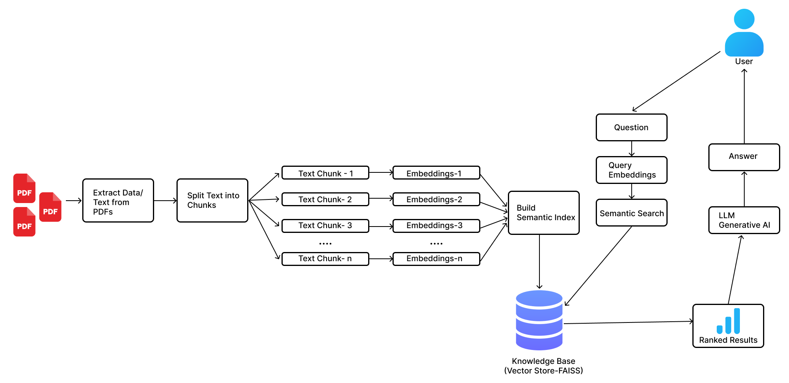

<div align="center">
      <h1>Customer Chatbot with Knowledge base</h1>
</div>


  ## Table of contents

  - [Overview](#overview)
  - [Architecture](#architecture)
  - [Features](#features)
  - [Requirements](#requirements)
  - [Installation](#installation)
  - [Usage](#usage)


  ## Overview

  This customer chatbot make it easy for customers to get answers with the use of AI capabilities with user-friendly accessibility. Developed using Python and powered by the LangChain framework, Chatbot facilitates seamless exploration and extraction of information from PDF documents through an intuitive web interface. Users can upload multiple PDF files(knowledge base), ask specific questions about their content, and receive detailed responses in real-time instantly.


  ## Architecture
  


  ## Features

  | Feature                        | Description                                                                                     |
  | ------------------------------ | ----------------------------------------------------------------------------------------------- |
  | PDF Processing                 | Upload multiple PDF files and have their contents processed for easy querying.                   |
  | Extensible Architecture        | Modular design allows for the addition of new features and integrations with minimal effort, code is modular, with interchangeable components that enhance reuse, maintainability, testing, and allow easy extensions and customizations. |
  | Conversational Interface       | Ask questions about your PDFs and get detailed, accurate responses.                               |
  | Interactive Chat Interface     | User-friendly chat interface built with Streamlit, allowing seamless interaction with the AI model. |
  | Financial Analysis Expertise   | Extract detailed financial information and present it with accuracy.                              |
  | Chat History Export            | Allows users to review and download chat history as a PDF document for reference.                         |
  | Reset Functionality            | Provides an option to reset the chat history, ensuring user privacy and a clean interface for new interactions.                       |
  | Integrations                  | Utilizes Google Generative AI for embeddings, FAISS for similarity search, Groq API for LLM models, and Streamlit for the web interface. Potential for further service integrations. |


  ## Requirements

  - `faiss-cpu`: Library for efficient similarity search
  - `groq`: Inferencing engine providing LLM models like Llama 3
  - `python-dotenv`: Library for managing environment variables from a `.env` file
  - `PyPDF2`: Library for extracting text from PDF files
  - `fpdf`: Library for creating PDF documents programmatically
  - `streamlit`: Web framework for interactive applications
  - `langchain`: Framework for natural language processing tasks
  - `langchain-groq`: Integration for Groq API and LLM models
  - `langchain_google-genai`: Integration for Google Generative AI embeddings
  - `langchain_community`: Additional community modules for LangChain framework


  ## Installation

  1.Clone this repository to your local machine using:
  ```bash
    git clone https://github.com/tshewangrinzin/Customer-Chatbot-Knowledge-base.git
  ```

  2.Navigate to the project directory:
  ```bash
    cd Customer-Chatbot-Knowledge-base
  ```

  3.Install the required dependencies using pip:
  ```bash
    pip install -r requirements.txt
  ```

  4.Rename `.env.example` to `.env` and acquire API keys through [aistudio.google.com](https://aistudio.google.com/) and [console.groq.com](https://console.groq.com) and put them in the `.env` file:
  ```bash
    GOOGLE_API_KEY="ENTER YOUR API"
    GROQ_API_KEY="ENTER YOUR API"
  ```


  ## Usage

  Run the Streamlit app by executing:

  ```bash
  streamlit run app.py
  ```

